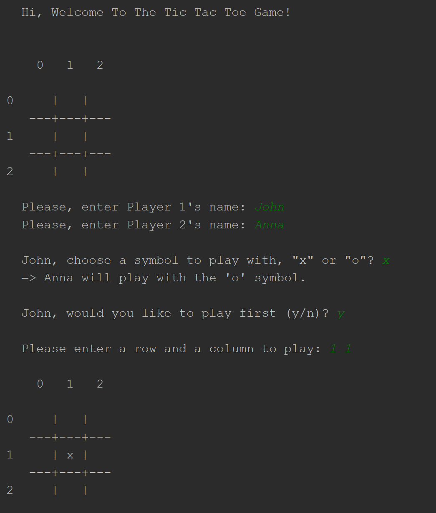
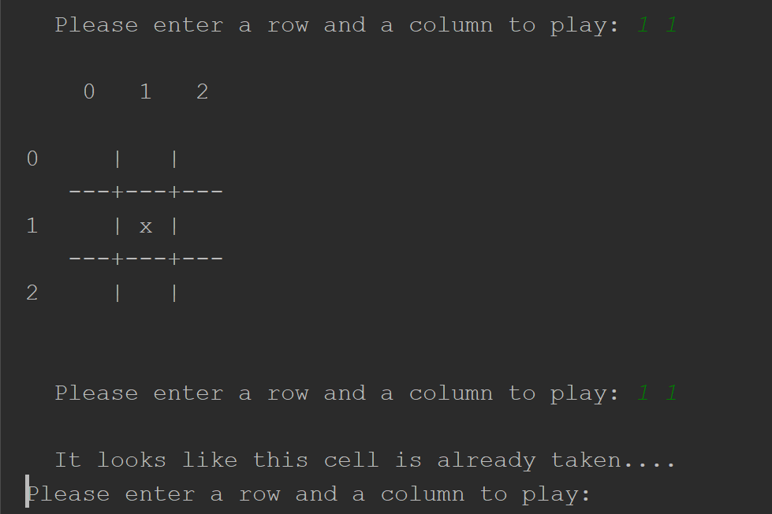

# COMP-330-F18
This is the first team project for COMP 330 Fall '18.

This is a Tic Tac Toe game developed in Java programming language.
The console takes in the player input by row and column index.
Two players can play the game until one of them wins or until the game is a draw.

In the following screenshot, the player wants to put the tick on the box in the middle.
To do that, the player needs to specify row and column number, separated by a space.
In this case, the player needs to input "1 1" - for row 1, column 1.

Then the game will continue in the same manner, until one of the players wins or the game is a draw.

If the player attempt to put their tick in a space that is already occupied, a message will appear stating that, and the player will be prompted to enter a row and a column numbers again to make their move.

